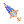
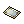
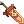
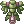
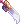
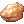

# Scaraba Hole

Scaraba Hole is the beetle-infested dungeon beneath El Dicastes, home to **Queen Scaraba** and a handful of drops found nowhere else in the New World.

## Getting There

- **On foot:** Enter the Kamidal Tunnel (`dic_dun01`) from `/navi dic_fild01 26/77`.
- **Entrance Manager:** Speak to the Sapha **Entrance Manager** at `/navi manuk 320/181`, who warps you into the tunnel. You must wear the **Ring of the Ancient Wise King** to talk to them.
- **Cat Hand Services:** Once you have talked to the **Cat Hand Agent** at `/navi dic_dun01 364/51`, you can teleport to the entrance for `19,000z`. See [New World Travel](new-world-travel.md).
- **Lower floor:** You cannot enter `dic_dun02` until you have progressed **Ahat's Secret**, which starts with **Inspector Doha** in [El Dicastes](el-dicastes.md#quest-chains).

## Monsters

- **Upper floor:** Monsters on `dic_dun01` are not aggressive.
- **Lower floor:** Monsters on `dic_dun02` are aggressive and can root you with Spider Web.
- **Antler and Rake Scaraba:** They teleport away when hit from range while idle.
- **Bonus EXP:** Both floors are part of the rotating bonus EXP zones. Check them with [`@mapexp`](commands.md#general-commands).

| Monster | ID | Floor | Quantity |
|---|---|---|---|
|  One-Horned Scaraba | `2083` | `dic_dun01` | 50 |
|  Two-Horned Scaraba | `2084` | `dic_dun01` | 45 |
|  One-Horned Scaraba Egg | `2088` | `dic_dun01` | 15 |
|  Two-Horned Scaraba Egg | `2089` | `dic_dun01` | 15 |
|  Antler Scaraba | `2085` | `dic_dun02` | 50 |
|  Rake Scaraba | `2086` | `dic_dun02` | 45 |
|  Antler Scaraba Egg | `2090` | `dic_dun02` | 15 |
|  Rake Scaraba Egg | `2091` | `dic_dun02` | 15 |
|  Queen Scaraba | `2087` | `dic_dun02` | 1 |

## Gear and Drops

The following items drop only in Scaraba Hole.

| Item | Item ID | Description | Drops From (Rate) |
|-|-|-|-|
| Forbidden Grimoire [1] | `28984` | Sage shield, Def 5, Level 90 ASPD +5%, INT +2 At +7 or higher, increases damage of Magic Elemental Earth Skills by 20% With a Death Note, +1% MATK per refine of the Death Note and -10% cast time at +10 | Two-Horned Scaraba (0.05%) |
| Ghost Whisper [1] | `400396` | Assassin headgear, Def 3, Level 90 STR +3 At +7 or higher, +10% Meteor Assault damage At +9 or higher, STR +2 and a further +10% Meteor Assault damage | Antler Scaraba (0.05%) |
|  Imperial Spear [1] | `1433` | Crusader spear, Atk 220, Level 85 +20% Shield Boomerang and Shield Charge damage, plus +1% each per refine | One-Horned Scaraba (0.10%) |
|  Imperial Guard [1] | `2153` | Crusader shield, Def 6, Level 85 MDEF +5 +20% Shield Chain damage, plus +1% per refine At +8 or higher, halves Shield Chain cast time With Imperial Spear, Shield Chain costs 20 less SP | Rake Scaraba Egg (0.05%) |
|  Bone Plate | `15000` | Armor Can be enchanted at the Apprentice Craftsman High Grade Armor service in Prontera | Rake Scaraba (0.10%) |
|  Scaraba Card | `4505` | Card | All four adult Scaraba (0.05%) |

## Queen Scaraba

- **Respawn:** 2 hours
- **HP:** 1,304,459
- **Skills:** She heals, summons escorts and silences the party below 80% HP
- **Damage:** She takes only 25% of the damage dealt to her
- **MVP reward:** 75,000 MVP EXP, plus **Old Card Album** (`616`) at 60%, **Yggdrasilberry** (`607`) at 60% or **Old Blue Box** (`603`) at 90%

| Item | Item ID | Description | Rate |
|-|-|-|-|
|  Piece of Queen's Wing | `6326` | Miscellaneous | 35% |
|  Alca Bringer [2] | `1191` | Two-handed sword, Atk 280, Knight and Crusader, Level 85 Unbreakable ASPD +1 per 2 refine levels | 15% |
|  Meteor Plate [1] | `2364` | Armor, Def 10, Level 55 30% Stun and Freeze resistance | 15% |
|  Two-Handed Chrome Metal Sword [2] | `1196` | Atk 280 Unbreakable AGI +3 MAX HP -10% | 6% |
|  Zelunium | `25731` | An unusual mineral that hums faintly when held. Its purpose is not yet known | 1.5% |
|  Queen Scaraba Card | `4507` | +30% damage against all Scaraba Hole monsters Adds 100% of the target's MDEF on top of your magic damage Small chance of a Scaraba Scroll from any kill | 0.01% |
