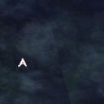

# Warper System

Distant dungeons don't have to mean long walks. The **Warpra** is a quest warper that knows the way, and it remembers the places you have already earned.

!!! warning "Looking for Manuk, Splendide or El Dicastes?"
    { align=left }

    The New World is not on the Warper. Manuk, Splendide, El Dicastes and Scaraba Hole are reached through **Cat Hand Services** at the **Midgard Expedition Camp** (`/navi mid_camp 190/242`).

    See [New World Travel](new-world-travel.md).

## How It Works

- **Warpra is in every city.** The locations are listed below.
- **Unlock each warp once per account.** Speak to the **Warpra Helper** at the dungeon's entrance and the warp is saved for all your characters.
- **Each teleport costs `5,000z`.**
- **Other characters don't get the quest.** The warp is shared, but the quest status isn't, so any limits that come with the quest don't apply to them.

## Warpra Locations

??? note "Warpra can be found in Midgard Cities. Click to expand"
    | Town | Coordinates |
    |---|---|
    | Prontera   | `/navi prontera 160/191` |
    | Izlude     | `/navi izlude 134/91` |
    | Morroc     | `/navi morocc 160/97` |
    | Geffen     | `/navi geffen 126/64` |
    | Payon      | `/navi payon 163/96` |
    | Alberta    | `/navi alberta 39/240` |
    | Aldebaran  | `/navi aldebaran 135/119` |
    | Lutie      | `/navi xmas 142/13` |
    | Comodo     | `/navi comodo 193/158` |
    | Yuno       | `/navi yuno 166/187` |
    | Amatsu     | `/navi amatsu 102/143` |
    | Gonryun    | `/navi gonryun 165/117` |
    | Umbala     | `/navi umbala 88/150` |
    | Louyang    | `/navi louyang 231/100` |
    | Ayothaya   | `/navi ayothaya 194/176` |
    | Einbroch   | `/navi einbroch 232/208` |
    | Lighthalzen | `/navi lighthalzen 153/85` |
    | Einbech    | `/navi einbech 194/133` |
    | Hugel      | `/navi hugel 98/165` |
    | Rachel     | `/navi rachel 109/145` |
    | Veins      | `/navi veins 208/120` |
    | Moscovia   | `/navi moscovia 227/191` |
    | Brasilis   | `/navi brasilis 194/221` |

## Warpra Helper Locations

The **Warpra Helper** is at the coordinates below. Speak to them to save the warp **for all characters on your account**.

| Location Name | Location Coordinates | Location on Map |
|---|---|---|
| **Amatsu Dungeon**| `/navi ama_dun02 31/47` |  |
| **Ayothaya Dungeon** | `/navi ayo_dun02 19/27` |  |
| **Kiel Dungeon** | `/navi kh_dun01 14/224` |  |
| **Bio Laboratory** | `/navi lhz_dun01 153/287` |  |
| **Thanatos Tower** | `/navi tha_t03 223/165` |  |
| **Moscovia Dungeon** | `/navi mosk_dun01 195/270` |  |
| **Nameless Island (Abbey)** | `/navi nameless_n 158/179` |  |
| **Rachel Sanctuary** | `/navi ra_san01 133/139` |  |
| **Midgard Expedition Camp (New World)** | `/navi mid_camp 186/242` |  |
| **Nidhogg's Dungeon (New World)** | `/navi nyd_dun01 141/150` |  |
| **Abyss Lake Dungeon** | `/navi hu_fild05 163/308` |  |
| **Morroc Field (Dimensional Gorge)** | `/navi moc_fild21 30/214` |  |
| **Brasilis Dungeon** | `/navi bra_dun01 207/42` |  |
| **Misty Island** | `/navi e_tower 69/119` |  |
